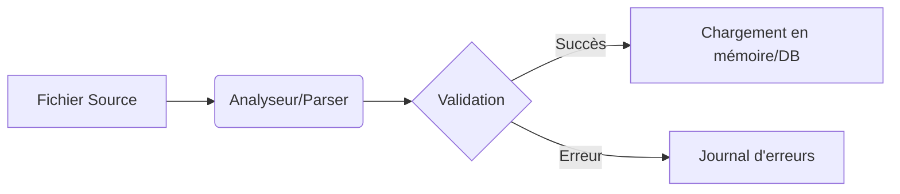

# 1-1-1 Import de données : fichiers CSV et texte délimité

L'acquisition de données commence souvent par la lecture de fichiers plats. Le format CSV (*Comma-Separated Values*) et ses variantes (fichiers délimités par des tabulations ou des points-virgules) constituent le standard d'échange le plus répandu entre les systèmes d'information.

## Concept fondamental

Un fichier texte délimité est un fichier structuré en lignes (enregistrements) et en colonnes (champs). La séparation entre les colonnes est marquée par un caractère spécifique appelé **délimiteur**.

### Structure type
```text
ID,Nom,Date_Inscription,Score
101,Dupont,2023-01-15,85.5
102,Martin,2023-02-20,92.0
```

## Fonctionnement détaillé

Le processus d'importation repose sur trois étapes logiques effectuées par le moteur de lecture (bibliothèque logicielle ou outil ETL) :

1.  **Analyse du schéma** : Détection du délimiteur, identification de la ligne d'en-tête (*header*) et typage des données (entier, chaîne, date).
2.  **Lecture ligne à ligne** : Parcours du flux de données.
3.  **Normalisation** : Conversion des types bruts vers les types de données cibles (ex: transformer une chaîne "2023-01-15" en objet `Date`).

### Diagramme de flux d'importation



## Comparatif des formats courants

| Format | Délimiteur courant | Usage principal |
| :--- | :--- | :--- |
| **CSV** | Virgule (`,`) | Échange standard, Excel |
| **TSV** | Tabulation (`\t`) | Données scientifiques, logs |
| **PSV** | Pipe (`\|`) | Systèmes Unix, fichiers complexes |

## Bonnes pratiques professionnelles

*   **Spécifier l'encodage** : Utilisez systématiquement l'encodage `UTF-8` pour éviter les problèmes de caractères spéciaux (accents, symboles monétaires).
*   **Définir le schéma explicitement** : Ne laissez pas le système deviner les types de données. Une colonne numérique lue comme texte empêchera tout calcul ultérieur.
*   **Gestion des valeurs manquantes** : Identifiez si une cellule vide doit être traitée comme `NULL`, `0` ou une chaîne vide dès l'import.
*   **Validation de structure** : Vérifiez le nombre de colonnes par ligne avant l'intégration pour éviter les erreurs de décalage de données.

## Erreurs fréquentes à éviter

1.  **Le problème du délimiteur dans la donnée** : Si le délimiteur (ex: virgule) est présent dans le contenu (ex: "Paris, France"), le parser coupera la ligne au mauvais endroit.
    *   *Solution* : Utiliser des guillemets (`"`) pour encapsuler les champs contenant le délimiteur.
2.  **L'inférence de type automatique** : Un identifiant commençant par `0` (ex: `00123`) peut être converti en entier `123` par certains outils, perdant ainsi le formatage initial.
3.  **Ignorer les fins de ligne** : Les différences entre `LF` (Linux/macOS) et `CRLF` (Windows) peuvent corrompre la lecture si le parser n'est pas configuré pour les détecter automatiquement.

## Exemple concret : Python (Pandas)

Dans un contexte de Data Science, l'importation est réalisée via des bibliothèques optimisées.

```python
import pandas as pd

# Import sécurisé avec spécification du séparateur et de l'encodage
df = pd.read_csv(
    'donnees_clients.csv', 
    sep=',', 
    encoding='utf-8',
    dtype={'ID': str, 'Score': float}, # Typage explicite
    na_values=['NA', 'N/A']            # Gestion des valeurs manquantes
)
```

## Points de vigilance

*   **Volumétrie** : Pour des fichiers de plusieurs gigaoctets, privilégiez une lecture par "chunks" (blocs) plutôt qu'un chargement complet en mémoire vive.
*   **Sécurité** : Ne jamais importer de fichiers CSV provenant de sources non fiables sans validation préalable (risque d'injection de commandes si le fichier est interprété par un script).

## Sources

*   *RFC 4180 : Common Format and MIME Type for Comma-Separated Values (CSV) Files.*
*   *Documentation officielle Pandas : I/O Tools (pandas.pydata.org).*