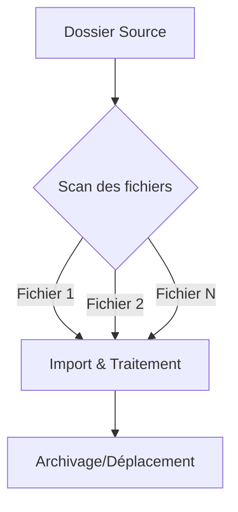

# 1-1-2 Utilisation de fonctions d'importation dynamique

L'importation dynamique consiste à automatiser la lecture de données sans intervention manuelle sur le code, en adaptant le comportement du programme aux fichiers présents dans un répertoire ou aux paramètres reçus en entrée.

## Concept fondamental

Contrairement à un import statique où le nom du fichier et son chemin sont codés en dur, l'import dynamique utilise des variables pour désigner les sources. Le programme "découvre" les fichiers à traiter au moment de l'exécution (*runtime*).

### Fonctionnement détaillé

Le processus repose sur trois piliers :
1.  **Exploration de répertoire** : Identification des fichiers cibles via des motifs (ex: `*.csv`).
2.  **Itération** : Boucle de traitement sur la liste des fichiers identifiés.
3.  **Paramétrage dynamique** : Adaptation des fonctions de lecture en fonction des métadonnées du fichier (ex: nom, date de création).



## Avantages et limites

| Avantages | Limites |
| :--- | :--- |
| **Scalabilité** : Traite 1 ou 1000 fichiers sans modifier le code. | **Complexité** : Nécessite une gestion robuste des erreurs. |
| **Automatisation** : Idéal pour les pipelines ETL. | **Risque** : Un fichier mal formé peut bloquer toute la chaîne. |
| **Flexibilité** : S'adapte aux changements de nommage. | **Débogage** : Plus difficile à tracer qu'un import unique. |

## Cas d'usage professionnels

*   **Collecte de logs** : Import quotidien des fichiers de logs générés par un serveur web.
*   **Intégration bancaire** : Traitement automatique des relevés déposés par des partenaires sur un serveur SFTP.
*   **IA / Machine Learning** : Chargement dynamique de jeux de données d'entraînement stockés dans des dossiers par date.

## Exemple concret : Automatisation en Python

Ce script parcourt un répertoire et importe tous les fichiers CSV trouvés.

```python
import pandas as pd
import glob
import os

dossier = "./data_entree/"
fichiers = glob.glob(os.path.join(dossier, "*.csv"))

for fichier in fichiers:
    try:
        # Import dynamique basé sur le nom du fichier
        df = pd.read_csv(fichier)
        print(f"Traitement de : {os.path.basename(fichier)}")
        # Logique de transformation ici
        
        # Déplacement vers un dossier 'traite' pour éviter le retraitement
        os.rename(fichier, os.path.join("./data_traite/", os.path.basename(fichier)))
    except Exception as e:
        print(f"Erreur sur {fichier} : {e}")
```

## Bonnes pratiques et points de vigilance

*   **Gestion de l'état (State Management)** : Déplacez ou renommez les fichiers traités. Ne laissez jamais un fichier dans le répertoire source après traitement, sous peine de le retraiter en boucle.
*   **Validation de schéma** : Vérifiez que la structure du fichier correspond aux attentes avant de lancer le traitement (ex: vérifier le nombre de colonnes).
*   **Journalisation (Logging)** : Enregistrez chaque étape (fichier trouvé, succès, échec) dans un fichier de log pour faciliter le diagnostic en cas d'incident.
*   **Gestion des exceptions** : Utilisez des blocs `try-except` pour isoler les erreurs. Si un fichier est corrompu, le script doit pouvoir passer au suivant sans s'arrêter.

## Erreurs fréquentes à éviter

*   **Le "Hardcoding"** : Utiliser des chemins absolus (ex: `C:\Users\Nom\Documents\...`) qui ne fonctionneront pas sur un serveur de production. Utilisez des chemins relatifs ou des variables d'environnement.
*   **Absence de filtrage** : Tenter d'importer des fichiers temporaires ou cachés (ex: `.DS_Store` sur macOS ou fichiers temporaires `~$` d'Excel) qui ne sont pas des données valides.
*   **Surcharge mémoire** : Importer tous les fichiers d'un répertoire en une seule fois dans une liste avant de les traiter. Traitez-les un par un.

## Sources

*   *Documentation Python : Module `glob` (Interface de recherche de chemins).*
*   *Documentation Python : Module `os` (Interaction avec le système d'exploitation).*