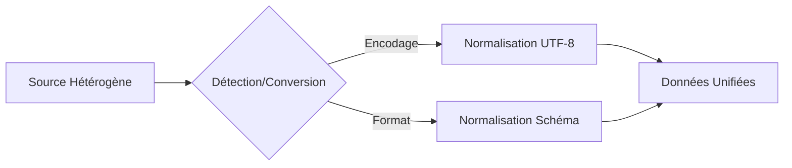

# 1-2-2 Gestion des encodages et des formats de données hétérogènes

La manipulation de données provenant de sources multiples (systèmes legacy, API internationales, fichiers générés par différents logiciels) confronte le développeur à des problèmes d'encodage et de formats incompatibles. La maîtrise de ces aspects est indispensable pour garantir l'intégrité de l'information.

## Concepts fondamentaux

### Encodage des caractères
L'encodage est la règle qui associe un caractère (lettre, symbole) à une valeur numérique binaire.
*   **UTF-8** : Le standard actuel. Il supporte la quasi-totalité des caractères mondiaux et est rétrocompatible avec l'ASCII.
*   **Latin-1 (ISO-8859-1)** : Ancien standard courant en Europe, souvent source de problèmes avec les caractères spéciaux (ex: `é` devient `é`).

### Formats hétérogènes
Il s'agit de données structurées différemment (ex: dates au format `JJ/MM/AAAA` vs `AAAA-MM-JJ`, séparateurs décimaux `.` vs `,`).

## Fonctionnement détaillé

Lorsqu'un système lit un fichier, il doit interpréter les octets selon un encodage précis. Si l'encodage déclaré diffère de l'encodage réel, le résultat est une corruption de texte (le "mojibake").

### Flux de normalisation


## Stratégies de gestion

### 1. Détection automatique
La plupart des outils modernes tentent de deviner l'encodage. Cependant, cette détection n'est pas fiable à 100%.
*   **Recommandation** : Toujours privilégier une spécification explicite de l'encodage si la source est connue.

### 2. Normalisation des formats
Pour les formats hétérogènes (dates, nombres), la stratégie consiste à transformer les données dès l'entrée vers un format pivot interne.

| Type | Format Source (Exemples) | Format Pivot (Recommandé) |
| :--- | :--- | :--- |
| **Date** | `DD/MM/YYYY`, `MM-DD-YYYY` | `YYYY-MM-DD` (ISO 8601) |
| **Décimal** | `1.234,56`, `1,234.56` | `1234.56` (Point décimal) |
| **Booléen** | `Oui/Non`, `1/0`, `T/F` | `True/False` |

## Exemple concret : Python

```python
import pandas as pd

# Gestion de l'encodage : tenter latin-1 si utf-8 échoue
try:
    df = pd.read_csv('donnees_legacy.csv', encoding='utf-8')
except UnicodeDecodeError:
    df = pd.read_csv('donnees_legacy.csv', encoding='latin-1')

# Normalisation d'un format de date hétérogène
df['date_op'] = pd.to_datetime(df['date_op'], dayfirst=True)

# Normalisation d'un séparateur décimal
df['prix'] = df['prix'].str.replace(',', '.').astype(float)
```

## Bonnes pratiques professionnelles

*   **Forcer l'UTF-8** : Lors de la création de nouveaux fichiers ou systèmes, imposez l'UTF-8 sans BOM (*Byte Order Mark*).
*   **Validation stricte** : Si une donnée ne respecte pas le format attendu après conversion, rejetez-la ou isolez-la dans une table d'erreurs plutôt que de tenter une correction automatique risquée.
*   **Documentation des sources** : Maintenez un dictionnaire de données précisant l'encodage et le format d'origine de chaque flux entrant.

## Erreurs fréquentes à éviter

*   **Ignorer les BOM** : Certains fichiers Windows commencent par des octets invisibles (BOM) qui peuvent corrompre la lecture du nom de la première colonne.
*   **Conversion destructive** : Convertir des nombres en chaînes de caractères pour "faciliter" le nettoyage, perdant ainsi la capacité de réaliser des calculs.
*   **Supposer l'encodage** : Ne jamais supposer que le système source utilise l'encodage par défaut de votre machine locale.

## Points de vigilance

*   **Performance** : La conversion d'encodage sur des fichiers très volumineux est une opération coûteuse. Effectuez-la lors de l'ingestion initiale.
*   **Caractères non supportés** : Lors de la conversion d'un encodage riche (UTF-8) vers un encodage restreint (ASCII), des caractères seront perdus. Utilisez des options de gestion d'erreurs (`replace` ou `ignore`) pour éviter le plantage du script.

## Sources

*   *Unicode Consortium : The Unicode Standard.*
*   *W3C : Character encodings (w3.org).*