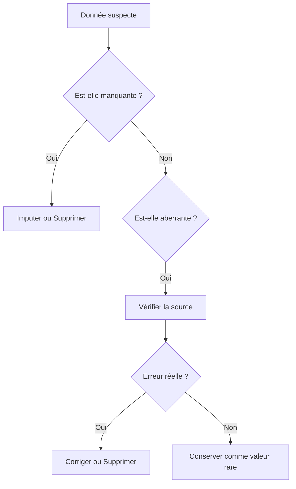

# 2-1-1 Détection et traitement des valeurs manquantes et aberrantes

La qualité des analyses dépend directement de la propreté des données. Les valeurs manquantes (données absentes) et les valeurs aberrantes (données statistiquement improbables) sont les deux principaux obstacles à la fiabilité des modèles et des rapports.

## Concepts fondamentaux

*   **Valeurs manquantes (Missing Values)** : Cellules vides, `NaN` (*Not a Number*), `None` ou `null`. Elles surviennent lors de pannes de capteurs, d'erreurs de saisie utilisateur ou de problèmes d'extraction.
*   **Valeurs aberrantes (Outliers)** : Observations qui s'écartent significativement du reste des données. Elles peuvent être des erreurs de mesure (ex: température de 500°C) ou des événements rares mais réels (ex: transaction bancaire exceptionnelle).

## Fonctionnement détaillé

### 1. Détection
*   **Valeurs manquantes** : Analyse de la densité de remplissage par colonne.
*   **Valeurs aberrantes** :
    *   **Méthode statistique** : Utilisation de l'écart-type (Z-score) ou de l'intervalle interquartile (IQR).
    *   **Méthode métier** : Définition de seuils logiques (ex: âge < 0 ou > 120).

### 2. Stratégies de traitement

| Type | Action | Usage |
| :--- | :--- | :--- |
| **Suppression** | Retirer la ligne ou la colonne | Si les données manquantes sont peu nombreuses (< 5%). |
| **Imputation** | Remplacer par une valeur (moyenne, médiane, mode) | Pour conserver le volume de données. |
| **Marquage** | Créer une colonne "est_manquant" | Pour garder l'information que la donnée était absente. |
| **Winsorisation** | Plafonner les valeurs extrêmes | Pour limiter l'impact des outliers sans les supprimer. |

## Exemple concret : Analyse avec Pandas

```python
import pandas as pd
import numpy as np

# Détection
print(df.isnull().sum()) # Compte les manquants

# Traitement des manquants : imputation par la médiane
mediane = df['salaire'].median()
df['salaire'] = df['salaire'].fillna(mediane)

# Traitement des aberrants : suppression via IQR
Q1 = df['age'].quantile(0.25)
Q3 = df['age'].quantile(0.75)
IQR = Q3 - Q1
df = df[(df['age'] >= Q1 - 1.5*IQR) & (df['age'] <= Q3 + 1.5*IQR)]
```

## Diagramme de décision



## Bonnes pratiques professionnelles

*   **Analyse de cause racine** : Avant de supprimer une valeur aberrante, déterminez si elle est le résultat d'un bug système ou d'une réalité métier.
*   **Documentation des choix** : Notez systématiquement la méthode d'imputation utilisée. L'imputation par la moyenne peut réduire artificiellement la variance d'un jeu de données.
*   **Validation croisée** : Vérifiez si le traitement des valeurs manquantes modifie la distribution globale de vos données.

## Erreurs fréquentes à éviter

*   **Imputation systématique par 0** : Remplacer une valeur manquante par 0 peut fausser les calculs (ex: moyenne des salaires). Utilisez la médiane ou la moyenne selon la distribution.
*   **Suppression massive** : Supprimer toutes les lignes contenant au moins une valeur manquante peut entraîner une perte de données critique, surtout si les manquants ne sont pas répartis aléatoirement.
*   **Ignorer les outliers** : Les valeurs aberrantes contiennent souvent des informations précieuses sur des fraudes, des pannes matérielles ou des comportements clients atypiques.

## Points de vigilance

*   **Données temporelles** : Pour les séries chronologiques, n'utilisez jamais la moyenne globale pour imputer. Utilisez des méthodes d'interpolation (ex: report de la valeur précédente ou moyenne mobile).
*   **Biais d'échantillonnage** : Si les données manquantes sont corrélées à une variable (ex: les clients les plus riches ne répondent pas à la question sur le salaire), la suppression des manquants introduira un biais dans votre analyse.

## Sources

*   *Documentation Pandas : Working with missing data.*
*   *Tukey, J. W. (1977). Exploratory Data Analysis (Méthode IQR).*