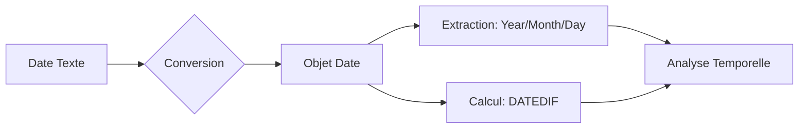

# 2-2-2 Traitement des données temporelles

Le traitement des dates est une étape critique de la préparation des données. Les dates sont souvent importées sous forme de chaînes de caractères (texte), ce qui empêche tout calcul chronologique. La normalisation et l'extraction de composantes temporelles permettent d'analyser des tendances, des durées et des saisonnalités.

## Concepts fondamentaux

Pour manipuler des dates, il faut les convertir en objets "Date" ou "Datetime". Une fois typées, ces données permettent :
*   **L'extraction** : Récupérer des segments (année, mois, jour).
*   **Le calcul** : Déterminer des écarts (durées).
*   **La conversion** : Transformer du texte en valeur numérique exploitable.

## Fonctions de manipulation temporelle

| Fonction | Rôle | Exemple |
| :--- | :--- | :--- |
| **DATEVALUE** | Convertit une date texte en valeur numérique (série temporelle). | `"2023-01-01"` -> `44927` |
| **YEAR / MONTH / DAY** | Extrait la composante spécifique d'une date. | `2023-05-15` -> `2023`, `5`, `15` |
| **DATEDIF** | Calcule la différence entre deux dates. | `DateFin - DateDebut` |

## Fonctionnement détaillé

### 1. Conversion (DATEVALUE)
Les systèmes de stockage (tableurs, bases de données) stockent souvent les dates comme un nombre entier représentant le nombre de jours écoulés depuis une date de référence (ex: 01/01/1900). `DATEVALUE` permet de forcer cette conversion pour permettre des tris chronologiques.

### 2. Extraction (YEAR, MONTH, DAY)
Ces fonctions sont utilisées pour créer des colonnes de regroupement.
*   *Usage* : Analyser les ventes par mois ou par année en extrayant ces informations de la colonne `date_transaction`.

### 3. Calcul de durée (DATEDIF)
Cette fonction est indispensable pour mesurer des délais.
*   *Usage* : Calculer l'ancienneté d'un employé (`DateAujourdhui - DateEmbauche`) ou le délai de livraison d'une commande.

## Exemple concret : Analyse des ventes

```python
import pandas as pd

# Conversion de texte en datetime
df['date'] = pd.to_datetime(df['date_str'])

# Extraction de composantes
df['annee'] = df['date'].dt.year
df['mois'] = df['date'].dt.month

# Calcul de délai (en jours)
df['delai_livraison'] = (df['date_livraison'] - df['date_commande']).dt.days
```

## Diagramme de flux de traitement



## Bonnes pratiques professionnelles

*   **Format ISO 8601** : Utilisez systématiquement le format `AAAA-MM-JJ` pour vos dates. C'est le standard international qui évite toute ambiguïté (ex: confusion entre format américain `MM/DD` et européen `DD/MM`).
*   **Gestion des fuseaux horaires** : Pour les données internationales, travaillez toujours en UTC (*Coordinated Universal Time*) pour éviter les décalages lors des calculs de durée.
*   **Validation** : Vérifiez toujours la cohérence des dates (ex: une date de livraison ne peut pas être antérieure à une date de commande).

## Erreurs fréquentes à éviter

*   **Calculs sur des chaînes** : Tenter de soustraire deux dates stockées en texte. Le résultat sera une erreur ou une valeur incohérente.
*   **Ignorer les années bissextiles** : Utiliser des calculs manuels (ex: multiplier le nombre de mois par 30) au lieu d'utiliser les fonctions natives de date qui gèrent automatiquement les calendriers.
*   **Ambiguïté de format** : Ne jamais supposer le format de date d'une source externe sans vérification préalable (ex: `01/02/2023` est-ce le 1er février ou le 2 janvier ?).

## Points de vigilance

*   **Performance** : Les calculs sur des colonnes de dates sont généralement rapides, mais évitez de recalculer les composantes (année, mois) à chaque requête si vous pouvez les stocker une fois pour toutes lors de l'ETL.
*   **Valeurs manquantes** : Une date manquante peut bloquer un calcul de durée. Prévoyez une valeur par défaut ou une exclusion de ces lignes.

## Sources

*   *ISO 8601 : Data elements and interchange formats.*
*   *Documentation Pandas : Time series / date functionality.*