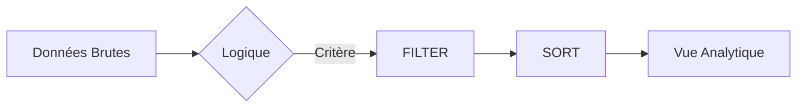

# 3-1-1 Filtrage intelligent : FILTER, SORT

Le filtrage et le tri sont les opérations les plus fréquentes en analyse de données. Contrairement aux filtres manuels (clics sur des en-têtes), les fonctions dynamiques permettent de créer des vues de données qui se mettent à jour automatiquement dès que la source change.

## Concepts fondamentaux

*   **FILTER** : Extrait un sous-ensemble de données répondant à un ou plusieurs critères logiques.
*   **SORT** : Réorganise les données selon une ou plusieurs colonnes, de manière croissante ou décroissante.

## Fonctionnement détaillé

Ces fonctions travaillent sur des plages de données (tableaux) et retournent des résultats dynamiques (tableaux de débordement).

### 1. Filtrage (FILTER)
La fonction `FILTER` nécessite deux arguments principaux : la plage de données à filtrer et la condition logique.
*   *Exemple* : `=FILTER(A2:C100; B2:B100 > 500)`
*   *Résultat* : Affiche uniquement les lignes où la colonne B est supérieure à 500.

### 2. Tri (SORT)
La fonction `SORT` permet de classer les données sans modifier la source originale.
*   *Exemple* : `=SORT(A2:C100; 3; -1)`
*   *Résultat* : Trie la plage A2:C100 selon la 3ème colonne, en ordre décroissant (`-1`).

## Comparatif : Filtre manuel vs Filtre dynamique

| Caractéristique | Filtre Manuel | Fonction FILTER/SORT |
| :--- | :--- | :--- |
| **Mise à jour** | Statique (nécessite réapplication) | Dynamique (automatique) |
| **Intégrité** | Modifie la vue de la source | Crée une vue séparée |
| **Complexité** | Faible | Moyenne (nécessite logique) |
| **Automatisation** | Non | Oui |

## Cas d'usage professionnels

*   **Tableaux de bord de suivi** : Extraire automatiquement les commandes en attente de livraison.
*   **Reporting commercial** : Afficher le top 10 des produits les plus vendus en combinant `SORT` et une fonction de limitation.
*   **Nettoyage de données** : Isoler les lignes contenant des erreurs ou des valeurs manquantes pour traitement ultérieur.

## Exemple concret : Analyse de ventes

Imaginons un tableau de ventes (Colonnes A: Produit, B: Montant, C: Date).

```excel
-- Filtrer les ventes > 1000 et les trier par montant décroissant
=SORT(FILTER(A2:C500; B2:B500 > 1000); 2; -1)
```

## Diagramme de flux



## Bonnes pratiques professionnelles

*   **Utilisation de plages nommées** : Utilisez des noms de plages (ex: `Ventes`) plutôt que des références de cellules (ex: `A2:C500`) pour rendre vos formules lisibles et robustes.
*   **Gestion des erreurs** : Utilisez l'argument "si_vide" de la fonction `FILTER` pour afficher un message clair (ex: "Aucune donnée trouvée") au lieu d'une erreur `#N/A`.
*   **Séparation des données** : Gardez vos données sources dans un onglet dédié et vos vues filtrées dans un onglet "Analyse".

## Erreurs fréquentes à éviter

*   **Chevauchement de données** : Les fonctions dynamiques nécessitent des cellules vides en dessous et à droite pour "déborder". Si une cellule est occupée, vous obtiendrez une erreur `#SPILL!` (ou `#DÉBORDEMENT!`).
*   **Tri sur des données non typées** : Trier une colonne contenant des nombres stockés en texte peut donner des résultats incohérents (ex: "10" avant "2"). Assurez-vous que le format est correct.
*   **Complexité excessive** : Si vous imbriquez trop de fonctions, la maintenance devient difficile. Préférez des étapes intermédiaires.

## Points de vigilance

*   **Performance** : Sur des jeux de données très volumineux (plusieurs dizaines de milliers de lignes), l'utilisation intensive de fonctions dynamiques peut ralentir le calcul du classeur.
*   **Référence circulaire** : Ne filtrez jamais une plage qui contient la formule de filtrage elle-même.

## Sources

*   *Documentation Microsoft Excel : Fonctions FILTER et SORT.*
*   *Documentation Google Sheets : Fonctions de filtrage et de tri.*