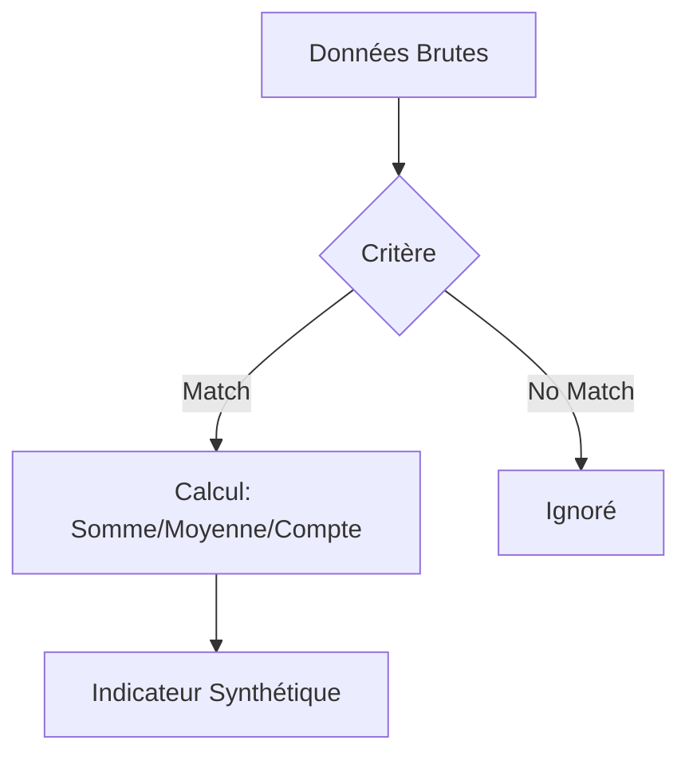

# 3-1-3 Agrégation et synthèse : SUMIF, COUNTIF, AVERAGEIF

L'agrégation conditionnelle permet de calculer des indicateurs clés (KPI) sur des sous-ensembles de données sans avoir à filtrer manuellement le tableau source. Ces fonctions sont le socle de la création de tableaux de bord dynamiques.

## Concepts fondamentaux

Ces fonctions effectuent un calcul mathématique uniquement sur les lignes qui respectent un critère défini.

*   **SUMIF (SOMME.SI)** : Additionne les valeurs d'une plage répondant à un critère.
*   **COUNTIF (NB.SI)** : Compte le nombre de cellules répondant à un critère.
*   **AVERAGEIF (MOYENNE.SI)** : Calcule la moyenne des valeurs répondant à un critère.

## Fonctionnement détaillé

La structure de ces fonctions est standardisée :
`=FONCTION(plage_critère; critère; [plage_somme])`

1.  **plage_critère** : La colonne où le test est effectué (ex: "Catégorie").
2.  **critère** : La condition à respecter (ex: "Ventes", ">100", ou une référence de cellule).
3.  **plage_somme** (optionnel) : La colonne contenant les valeurs à calculer (utilisé pour `SUMIF` et `AVERAGEIF`).

### Exemple de syntaxe
```excel
-- Compter les commandes de la catégorie "Logiciel"
=COUNTIF(B2:B100; "Logiciel")

-- Somme des montants pour la catégorie "Logiciel"
=SUMIF(B2:B100; "Logiciel"; C2:C100)
```

## Cas d'usage professionnels

*   **Gestion financière** : Calculer le total des dépenses par centre de coût.
*   **Ressources Humaines** : Compter le nombre d'employés par département ou calculer l'ancienneté moyenne par équipe.
*   **Marketing** : Calculer le taux de conversion moyen par canal d'acquisition.

## Comparatif : Fonctions simples vs Fonctions avec "S"

La plupart des tableurs proposent également des versions au pluriel (`SUMIFS`, `COUNTIFS`, `AVERAGEIFS`) permettant d'appliquer plusieurs critères simultanément.

| Fonction | Nombre de critères | Flexibilité |
| :--- | :--- | :--- |
| `SUMIF` | 1 | Limitée |
| `SUMIFS` | Plusieurs | Élevée |

*Recommandation : Utilisez systématiquement les versions au pluriel (`SUMIFS`, `COUNTIFS`) même pour un seul critère. Cela facilite l'ajout ultérieur de conditions sans modifier la structure de la formule.*

## Diagramme de synthèse



## Bonnes pratiques professionnelles

*   **Utilisation de références de cellules** : Au lieu d'écrire le critère en dur dans la formule (ex: `">100"`), placez la valeur dans une cellule dédiée. Cela rend le tableau interactif.
*   **Cohérence des plages** : Assurez-vous que la `plage_critère` et la `plage_somme` ont exactement la même taille (ex: `B2:B100` et `C2:C100`). Une erreur de décalage faussera les résultats sans générer d'alerte.
*   **Nettoyage préalable** : Ces fonctions sont sensibles aux espaces invisibles. Un `SUMIF` cherchant "Ventes" ne trouvera pas "Ventes ". Utilisez `TRIM` sur vos données sources avant agrégation.

## Erreurs fréquentes à éviter

*   **Oublier les guillemets** : Les critères textuels ou les opérateurs logiques doivent être entre guillemets (ex: `">100"`).
*   **Confusion entre critères** : Utiliser `COUNTIF` pour sommer des valeurs au lieu de compter des occurrences.
*   **Données non numériques** : Tenter un `SUMIF` ou `AVERAGEIF` sur une colonne contenant des nombres stockés sous forme de texte.

## Points de vigilance

*   **Performance** : L'utilisation massive de ces fonctions sur des milliers de lignes peut ralentir le calcul. Pour des analyses complexes, préférez les **Tableaux Croisés Dynamiques (TCD)** ou Power Query, qui sont optimisés pour l'agrégation.
*   **Valeurs vides** : `AVERAGEIF` ignore les cellules vides, mais pas les cellules contenant `0`. Cela peut biaiser vos moyennes si les données ne sont pas propres.

## Sources

*   *Documentation Microsoft Excel : Fonctions SOMME.SI et NB.SI.*
*   *Documentation Google Sheets : Fonctions d'agrégation conditionnelle.*