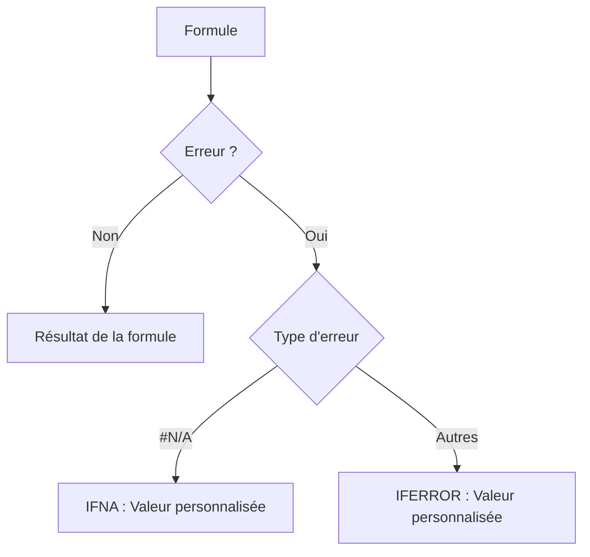

# 3-2-1 Traitement des erreurs : IFERROR, IFNA

La gestion des erreurs est une étape indispensable pour fiabiliser les outils de reporting. Une erreur non traitée (ex: `#N/A`, `#DIV/0!`) peut bloquer des calculs en cascade et nuire à la lisibilité des tableaux de bord.

## Concepts fondamentaux

Les fonctions de traitement d'erreurs permettent de définir une valeur de remplacement lorsqu'une formule échoue, garantissant ainsi la continuité des calculs.

*   **IFERROR (SIERREUR)** : Capture **tous** les types d'erreurs (`#N/A`, `#VALUE!`, `#REF!`, `#DIV/0!`, etc.) et renvoie une valeur personnalisée.
*   **IFNA (SINA)** : Capture **uniquement** l'erreur `#N/A` (généralement issue d'une recherche infructueuse).

## Fonctionnement détaillé

La syntaxe est identique pour les deux fonctions :
`=FONCTION(formule_à_tester; valeur_si_erreur)`

### 1. IFERROR
Utilisée pour masquer des erreurs techniques ou des calculs impossibles.
*   *Exemple* : `=IFERROR(A1/B1; 0)`
*   Si `B1` est 0, la formule renvoie `0` au lieu de `#DIV/0!`.

### 2. IFNA
Utilisée spécifiquement pour les fonctions de recherche (`XLOOKUP`, `VLOOKUP`). Elle permet de distinguer une recherche infructueuse d'une erreur de syntaxe ou de calcul.
*   *Exemple* : `=IFNA(XLOOKUP(id; plage_id; plage_nom); "Client inconnu")`

## Comparatif : IFERROR vs IFNA

| Fonction | Portée | Usage recommandé |
| :--- | :--- | :--- |
| **IFERROR** | Générale (toutes erreurs) | Calculs mathématiques, formules complexes. |
| **IFNA** | Spécifique (`#N/A`) | Fonctions de recherche et jointures. |

## Diagramme de flux

## Cas d'usage professionnels

*   **Reporting automatisé** : Remplacer les erreurs `#N/A` par "Non trouvé" ou "0" pour éviter que les graphiques ne soient corrompus.
*   **Calculs financiers** : Éviter les erreurs de division par zéro lors du calcul de ratios de croissance.
*   **Nettoyage de données** : Identifier rapidement les lignes où une correspondance n'a pas été trouvée lors d'un enrichissement de base de données.

## Bonnes pratiques professionnelles

*   **Utiliser IFNA par défaut pour les recherches** : Cela permet de laisser apparaître les autres erreurs (ex: `#REF!`) qui indiquent un problème structurel dans le fichier, plutôt que de les masquer aveuglément avec `IFERROR`.
*   **Valeurs de remplacement explicites** : Utilisez des messages clairs ("Non trouvé", "N/A") plutôt que des valeurs numériques (0) qui pourraient être confondues avec des données réelles.
*   **Débogage** : Ne masquez pas les erreurs pendant la phase de construction de votre modèle. Appliquez le traitement d'erreurs uniquement une fois la logique validée.

## Erreurs fréquentes à éviter

*   **Masquage aveugle** : Utiliser `IFERROR` sur une formule complexe peut masquer des erreurs critiques (ex: une référence de cellule supprimée) et rendre le débogage impossible.
*   **Confusion de type** : Remplacer une erreur par une chaîne de texte dans une colonne destinée à des calculs mathématiques (cela provoquera une erreur `#VALUE!` dans les calculs suivants).

## Points de vigilance

*   **Performance** : L'imbrication excessive de fonctions de gestion d'erreurs peut alourdir le temps de calcul sur des fichiers volumineux.
*   **Intégrité des données** : Une erreur est parfois une information utile (ex: un produit qui n'existe pas dans le référentiel). Traitez l'erreur, mais assurez-vous que l'information est bien remontée pour correction.

## Sources

*   *Documentation Microsoft Support : Fonctions SIERREUR et SINA.*
*   *Documentation Google Sheets : Fonctions de gestion d'erreurs.*