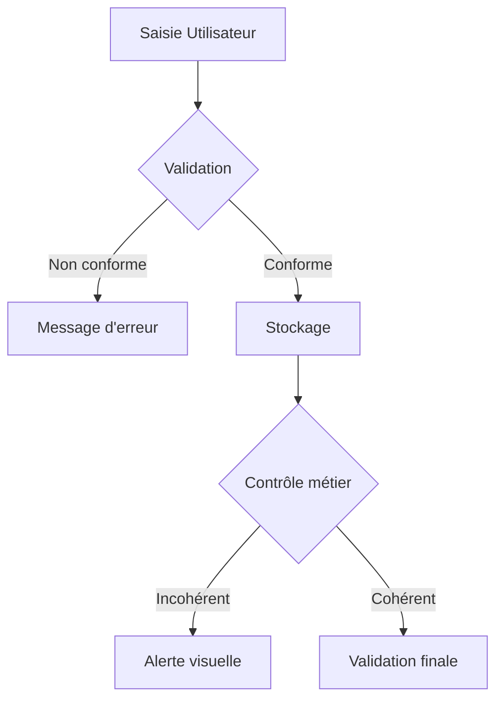

# 3-2-2 Validation des données et contrôles de cohérence

La validation des données consiste à restreindre les saisies utilisateur pour garantir l'intégrité des informations dès leur entrée. Les contrôles de cohérence, quant à eux, permettent de vérifier la logique métier après la saisie.

## Concepts fondamentaux

*   **Validation des données** : Mécanisme empêchant la saisie de valeurs non conformes (ex: interdire une date future pour une date de naissance).
*   **Contrôle de cohérence** : Formules ou scripts vérifiant que les données saisies respectent des règles métier croisées (ex: le total d'une facture doit correspondre à la somme des lignes).

## Fonctionnement détaillé

### 1. Validation native (Outil de saisie)
La plupart des tableurs proposent un menu "Validation des données" permettant de définir :
*   **Listes déroulantes** : Forcer le choix parmi des valeurs prédéfinies.
*   **Plages numériques** : Restreindre les saisies (ex: pourcentage entre 0 et 100).
*   **Formats personnalisés** : Utiliser des formules pour valider la saisie (ex: longueur d'un code produit).

### 2. Contrôles de cohérence (Audit)
Il s'agit de colonnes ou de cellules dédiées à l'alerte.
*   *Exemple* : `=SI(Somme_Lignes <> Total_Facture; "Erreur"; "OK")`

## Comparatif : Validation vs Contrôle

| Caractéristique | Validation des données | Contrôle de cohérence |
| :--- | :--- | :--- |
| **Moment** | Avant/Pendant la saisie | Après la saisie |
| **Action** | Bloque la saisie | Affiche une alerte |
| **Complexité** | Faible (paramétrage) | Moyenne (formules/logique) |
| **Objectif** | Prévenir l'erreur | Détecter l'erreur |

## Cas d'usage professionnels

*   **Saisie de formulaires** : Restreindre la saisie d'un `Code Client` à un format spécifique (ex: 3 lettres suivies de 4 chiffres).
*   **Gestion de stocks** : Alerter si la quantité sortie est supérieure à la quantité en stock.
*   **Comptabilité** : Vérifier que la somme des débits est égale à la somme des crédits.

## Diagramme de contrôle

## Bonnes pratiques professionnelles

*   **Messages d'erreur explicites** : Ne vous contentez pas d'un message système. Indiquez la règle attendue (ex: "Veuillez saisir un montant positif").
*   **Utilisation de la mise en forme conditionnelle** : Pour les contrôles de cohérence, utilisez des couleurs (ex: fond rouge pour les cellules en erreur) pour attirer l'attention immédiatement.
*   **Centralisation des listes** : Stockez les sources de vos listes déroulantes dans un onglet "Paramètres" masqué pour éviter les modifications accidentelles.

## Erreurs fréquentes à éviter

*   **Validation trop restrictive** : Bloquer des saisies valides en raison d'une règle mal définie.
*   **Oubli de protection** : Laisser les utilisateurs modifier les formules de contrôle de cohérence. Protégez les feuilles de calcul pour verrouiller ces zones.
*   **Ignorer les copier-coller** : La validation des données native est parfois contournée par un copier-coller. Prévoyez toujours un contrôle de cohérence en complément.

## Points de vigilance

*   **Performance** : Les contrôles de cohérence complexes sur des milliers de lignes peuvent ralentir le classeur.
*   **Maintenance** : Une règle métier qui change nécessite une mise à jour de la validation et des contrôles. Documentez vos règles dans un dictionnaire de données.

## Sources

*   *Documentation Microsoft Support : Appliquer la validation des données.*
*   *Documentation Google Sheets : Créer une liste déroulante.*