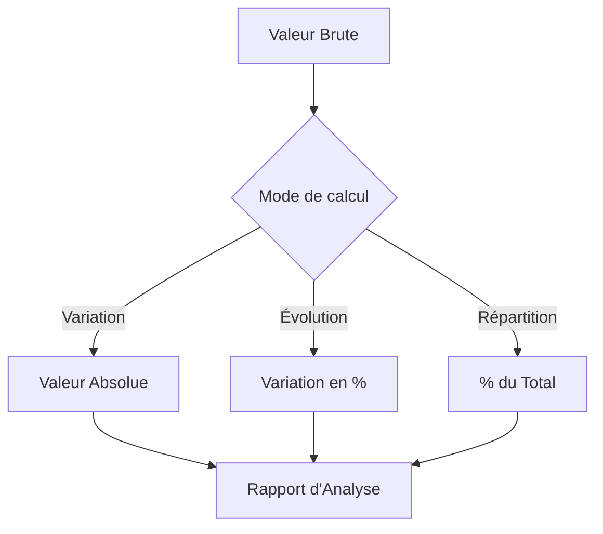

# 4-1-2 Analyse comparative et calcul de variations

L'analyse comparative consiste à mesurer l'évolution de données dans le temps ou à comparer des performances entre entités. Les Tableaux Croisés Dynamiques (TCD) offrent des outils intégrés pour automatiser ces calculs sans ajouter de colonnes dans la source.

## Concepts fondamentaux

*   **Valeur absolue** : La différence brute entre deux périodes (ex: Ventes N - Ventes N-1).
*   **Valeur relative (Variation en %)** : Le pourcentage d'évolution (ex: (Ventes N - Ventes N-1) / Ventes N-1).
*   **Calculs "Afficher les valeurs"** : Fonctionnalité native des TCD permettant de transformer un nombre brut en pourcentage du total, en rang, ou en variation par rapport à un élément précédent.

## Fonctionnement détaillé

Dans un TCD, vous pouvez modifier le mode de calcul d'un champ de valeur :

1.  Faites un clic droit sur une valeur dans le TCD.
2.  Sélectionnez **"Afficher les valeurs"**.
3.  Choisissez l'option appropriée :
    *   **% de la différence par rapport à** : Idéal pour comparer une période de référence (ex: Mois précédent).
    *   **% du total de la ligne/colonne** : Utile pour analyser la répartition (ex: part de marché d'un produit).
    *   **Différence par rapport à** : Pour obtenir l'écart en valeur absolue.

### Exemple de configuration pour une variation mensuelle
*   **Champ de base** : Mois.
*   **Élément de base** : (précédent).
*   **Type de calcul** : % de la différence par rapport à.

## Cas d'usage professionnels

*   **Suivi budgétaire** : Comparer les dépenses réelles vs budget et calculer l'écart en pourcentage.
*   **Analyse commerciale** : Identifier les produits dont les ventes ont le plus progressé par rapport au trimestre précédent.
*   **Reporting RH** : Analyser le taux de rotation du personnel par département sur deux années consécutives.

## Comparatif des méthodes de calcul

| Méthode | Avantages | Limites |
| :--- | :--- | :--- |
| **Calcul natif TCD** | Rapide, dynamique, pas de formule. | Moins flexible pour des calculs complexes. |
| **Champs calculés** | Personnalisable, réutilisable. | Peut être complexe à déboguer. |
| **Formules externes** | Flexibilité totale. | Risque d'erreur si la structure du TCD change. |

## Diagramme de calcul

## Bonnes pratiques professionnelles

*   **Utiliser les segments (Slicers)** : Ajoutez des segments pour filtrer vos analyses comparatives par année ou par région sans modifier la structure du TCD.
*   **Nommer les champs** : Renommez les champs calculés dans le TCD (ex: "Variation %") pour que le rapport soit lisible par des tiers.
*   **Formatage conditionnel** : Appliquez une mise en forme conditionnelle (barres de données ou jeux d'icônes) sur les colonnes de variation pour identifier instantanément les tendances positives ou négatives.

## Erreurs fréquentes à éviter

*   **Division par zéro** : Si la période de référence est vide ou nulle, le calcul de variation en % renverra une erreur. Utilisez les options de gestion d'erreurs du TCD pour afficher "0" ou "-" à la place.
*   **Mauvais choix de l'élément de base** : Sélectionner un élément fixe (ex: "Janvier") au lieu de "(précédent)" rendra le TCD statique et non évolutif.
*   **Confusion entre % du total et % de variation** : Bien vérifier la nature du calcul pour ne pas interpréter une part de marché comme une croissance.

## Points de vigilance

*   **Intégrité des données temporelles** : Assurez-vous que vos dates sont correctement formatées. Si une date manque dans la série, le calcul "par rapport au précédent" sera faussé.
*   **Complexité visuelle** : Ne surchargez pas un seul TCD avec trop de colonnes de calculs. Préférez créer plusieurs TCD simples pour des analyses distinctes.

## Sources

*   *Documentation Microsoft Support : Afficher des valeurs différentes dans les rapports de tableau croisé dynamique.*
*   *Documentation Google Sheets : Utiliser les calculs personnalisés dans les TCD.*