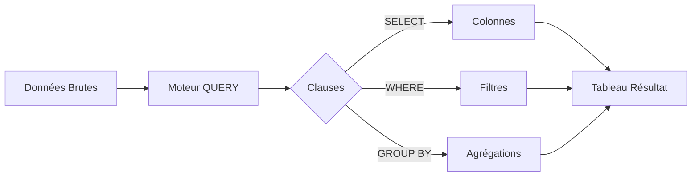

# 4-2-1 Requêtes structurées : utilisation de QUERY

La fonction `QUERY` (spécifique à Google Sheets) permet d'interroger des plages de données en utilisant une syntaxe proche du langage SQL. Elle offre une puissance de traitement bien supérieure aux fonctions de recherche classiques, permettant de filtrer, trier, agréger et restructurer des données en une seule formule.

## Concepts fondamentaux

La fonction `QUERY` s'articule autour de trois arguments :
`=QUERY(données; requête; [en-têtes])`

*   **données** : La plage source (ex: `A1:D100`).
*   **requête** : La chaîne de caractères contenant les instructions (ex: `"SELECT A, B WHERE C > 100"`).
*   **en-têtes** : Nombre de lignes d'en-tête dans la source (généralement 1).

## Fonctionnement détaillé

La puissance de `QUERY` réside dans ses clauses :

*   **SELECT** : Choisit les colonnes à afficher.
*   **WHERE** : Filtre les lignes selon une condition.
*   **GROUP BY** : Agrège les données (nécessite une fonction comme `SUM` ou `COUNT`).
*   **ORDER BY** : Trie les résultats (ex: `ORDER BY B DESC`).
*   **LIMIT** : Restreint le nombre de lignes retournées.

### Exemple concret
Extraire les noms et montants des ventes supérieures à 500€, triés par montant décroissant :
```excel
=QUERY(A1:D100; "SELECT B, D WHERE D > 500 ORDER BY D DESC"; 1)
```

## Comparatif : Fonctions classiques vs QUERY

| Fonctionnalité | Fonctions classiques (VLOOKUP, FILTER) | QUERY |
| :--- | :--- | :--- |
| **Complexité** | Élevée (imbrication) | Faible (syntaxe unique) |
| **Flexibilité** | Limitée | Très élevée |
| **Performance** | Moyenne | Optimisée |
| **Maintenance** | Difficile | Facile (formule unique) |

## Cas d'usage professionnels

*   **Consolidation multi-onglets** : Extraire des données spécifiques depuis plusieurs feuilles vers un tableau de bord central.
*   **Nettoyage de données** : Supprimer les lignes vides ou filtrer des données aberrantes avant analyse.
*   **Reporting dynamique** : Créer des vues personnalisées (ex: "Top 10 des clients par région") qui se mettent à jour automatiquement.

## Diagramme de traitement



## Bonnes pratiques professionnelles

*   **Référence de cellule dans la requête** : Pour rendre la requête dynamique, concaténez les références de cellules :
    `=QUERY(A1:D100; "SELECT B WHERE C = '" & E1 & "'"; 1)`
*   **Utilisation des alias** : Utilisez `LABEL` pour renommer les colonnes dans le résultat final :
    `=QUERY(A1:D100; "SELECT A, SUM(B) GROUP BY A LABEL SUM(B) 'Total Ventes'"; 1)`
*   **Documentation** : Comme la logique est encapsulée dans une chaîne de texte, commentez vos formules ou utilisez des cellules de paramètres pour expliquer les critères.

## Erreurs fréquentes à éviter

*   **Incohérence de type** : `QUERY` est strict sur les types. Si une colonne contient des nombres et du texte, les calculs (`SUM`, `AVG`) échoueront.
*   **Erreurs de syntaxe SQL** : Oublier les guillemets simples pour les critères textuels (ex: `WHERE A = 'France'`).
*   **Plage de données trop large** : Inclure des colonnes vides inutiles dans la plage source peut ralentir le calcul.

## Points de vigilance

*   **Portabilité** : `QUERY` est une fonction propriétaire de Google Sheets. Elle n'est pas disponible dans Microsoft Excel (qui utilise Power Query pour des besoins similaires).
*   **Débogage** : En cas d'erreur `#VALUE!`, vérifiez d'abord la syntaxe de la chaîne de requête. Les messages d'erreur sont parfois peu explicites.

## Sources

*   *Documentation Google Sheets : Fonction QUERY.*
*   *Guide de référence du langage de requête Google Visualization API.*