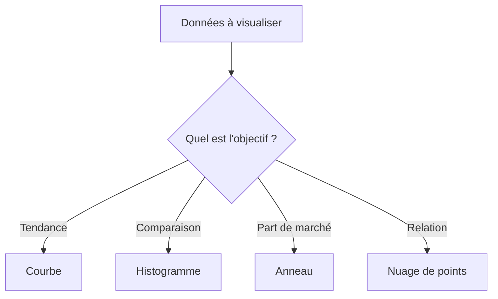

# 5-1-1 Création de graphiques pertinents

La visualisation de données (DataViz) transforme des séries numériques en messages visuels. Un graphique pertinent doit permettre une lecture immédiate de l'information sans nécessiter d'explications supplémentaires.

## Concepts fondamentaux

Le choix d'un graphique dépend de la nature du message à transmettre :
*   **Évolution** : Montrer une tendance sur une période.
*   **Comparaison** : Opposer des valeurs entre catégories.
*   **Composition** : Analyser la part de chaque élément dans un tout.
*   **Distribution** : Observer la répartition de valeurs.

## Guide de sélection des graphiques

| Type de message | Graphique recommandé |
| :--- | :--- |
| Évolution temporelle | Courbe (Line chart) |
| Comparaison de catégories | Histogramme (Bar chart) |
| Part d'un tout | Graphique en secteurs (Pie) ou en anneau |
| Corrélation | Nuage de points (Scatter plot) |

## Fonctionnement détaillé

La création d'un graphique efficace suit trois étapes :
1.  **Préparation** : Nettoyer et agréger les données (via TCD ou `QUERY`).
2.  **Sélection** : Choisir le type de graphique adapté au message.
3.  **Épuration** : Supprimer les éléments inutiles (lignes de quadrillage excessives, légendes redondantes, effets 3D).

## Diagramme de décision

## Bonnes pratiques professionnelles

*   **Ordre des données** : Dans un histogramme, triez toujours les barres par valeur (croissant ou décroissant) pour faciliter la lecture, sauf si l'ordre est temporel.
*   **Axe des ordonnées** : Commencez toujours l'axe des ordonnées à zéro pour éviter de fausser la perception des écarts.
*   **Utilisation de la couleur** : Utilisez une couleur unique pour les données homogènes. Réservez une couleur contrastée uniquement pour mettre en évidence un point spécifique (ex: "Notre performance" vs "Moyenne secteur").
*   **Titres explicites** : Le titre doit résumer le message (ex: "Croissance des ventes de 15% en 2023" plutôt que "Ventes par mois").

## Erreurs fréquentes à éviter

*   **Effets 3D** : Ils déforment la perspective et rendent la lecture des valeurs imprécise.
*   **Surcharge** : Trop de séries de données sur un seul graphique le rendent illisible ("graphique spaghetti").
*   **Graphiques en secteurs (Pie charts) avec trop de tranches** : Limitez-vous à 5 catégories maximum. Au-delà, préférez un histogramme.
*   **Légendes éloignées** : Placez les étiquettes directement sur les données si possible pour éviter les allers-retours visuels avec la légende.

## Points de vigilance

*   **Accessibilité** : Pensez aux daltoniens en évitant les combinaisons rouge/vert. Utilisez des textures ou des nuances de luminosité.
*   **Contexte** : Un graphique sans contexte (période, unité, source) perd sa valeur probante.
*   **Intégrité** : Ne manipulez pas les échelles pour exagérer une tendance. La fidélité aux données est la base de la crédibilité.

## Sources

*   *Stephen Few, "Show Me the Numbers: Designing Tables and Graphs to Enlighten".*
*   *Cole Nussbaumer Knaflic, "Storytelling with Data".*