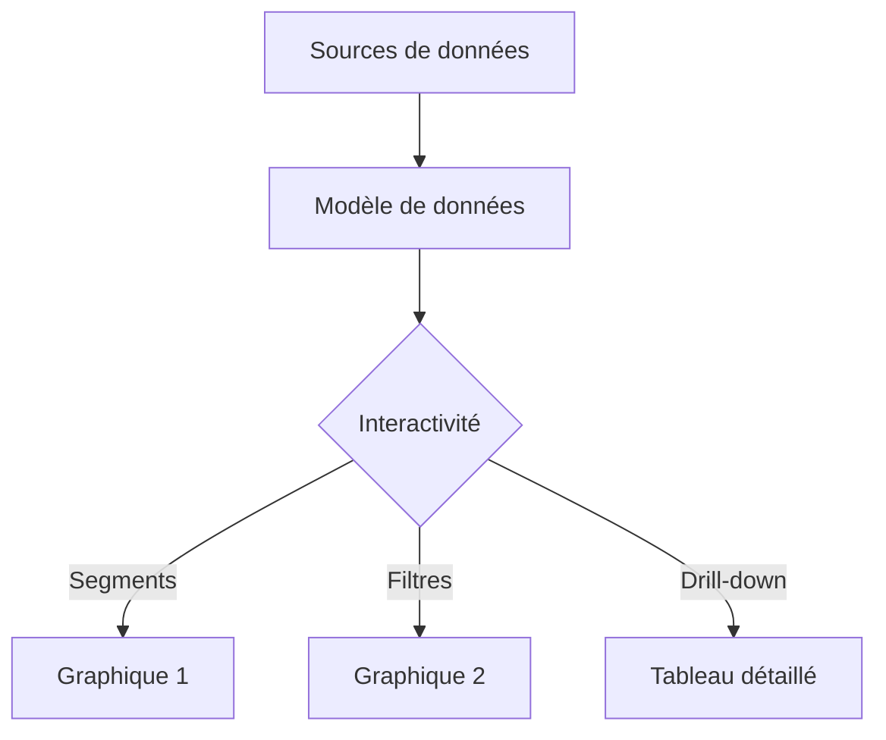

# 5-1-2 Tableaux de bord (dashboards) interactifs

Un tableau de bord est une interface consolidant des indicateurs clés de performance (KPI) pour faciliter la prise de décision. L'interactivité permet à l'utilisateur de filtrer et d'explorer les données selon ses besoins spécifiques.

## Concepts fondamentaux

*   **KPI (Key Performance Indicator)** : Indicateur chiffré mesurant l'atteinte d'un objectif.
*   **Interactivité** : Capacité du tableau de bord à réagir aux actions de l'utilisateur (filtres, segments, drill-down).
*   **Drill-down** : Action de descendre dans le détail d'une donnée (ex: passer d'un CA global à un CA par produit).

## Fonctionnement détaillé

La construction d'un tableau de bord interactif suit une logique de couches :

1.  **Couche Données** : Sources brutes (bases de données, fichiers, API).
2.  **Couche Traitement** : Nettoyage et agrégation (TCD, `QUERY`, Power Query).
3.  **Couche Visualisation** : Graphiques et indicateurs.
4.  **Couche Interactivité** : Segments, menus déroulants et liens dynamiques.

### Exemple de structure d'un tableau de bord
*   **En-tête** : Titre, date de dernière mise à jour, filtres globaux (Date, Région).
*   **Zone haute** : Indicateurs clés (KPI) sous forme de cartes (ex: CA total, Marge, Nombre de clients).
*   **Zone centrale** : Graphiques de tendance et de répartition.
*   **Zone basse** : Tableaux de détails pour l'analyse fine.

## Diagramme de flux d'un tableau de bord

## Avantages et limites

| Avantages | Limites |
| :--- | :--- |
| Vision globale en un coup d'œil | Risque de surcharge cognitive |
| Autonomie des utilisateurs | Dépendance à la qualité des données sources |
| Réactivité face aux changements | Temps de développement initial |

## Bonnes pratiques professionnelles

*   **Règle des 5 secondes** : L'utilisateur doit comprendre l'état de santé de son activité en moins de 5 secondes.
*   **Hiérarchie visuelle** : Placez les informations les plus importantes en haut à gauche (sens de lecture naturel).
*   **Cohérence graphique** : Utilisez une palette de couleurs limitée et identique pour les mêmes catégories à travers tout le tableau de bord.
*   **Automatisation** : Connectez vos sources de données pour que le tableau de bord se mette à jour sans intervention manuelle.

## Erreurs fréquentes à éviter

*   **Vouloir tout afficher** : Un tableau de bord n'est pas un rapport exhaustif. Ne gardez que ce qui est actionnable.
*   **Manque de contexte** : Afficher un chiffre sans cible ou sans historique (ex: "CA : 1M€" sans savoir si c'est bon ou mauvais).
*   **Interactivité complexe** : Si l'utilisateur doit cliquer 10 fois pour obtenir une information, le tableau de bord est mal conçu.

## Points de vigilance

*   **Performance** : Trop de graphiques complexes ralentissent le chargement.
*   **Sécurité** : Assurez-vous que les utilisateurs n'ont accès qu'aux données qu'ils sont autorisés à consulter (gestion des droits).
*   **Maintenance** : Un tableau de bord est un outil vivant. Prévoyez des revues régulières pour vérifier la pertinence des KPI affichés.

## Sources

*   *Stephen Few, "Information Dashboard Design: Displaying Data for At-a-Glance Monitoring".*
*   *Documentation Microsoft Power BI : Bonnes pratiques de conception.*