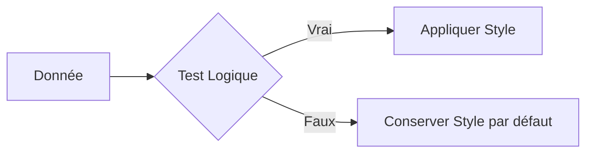

# 5-2-1 Mise en forme conditionnelle

La mise en forme conditionnelle permet d'appliquer automatiquement un format (couleur, police, bordure) à une cellule en fonction de sa valeur ou du résultat d'une formule. Elle transforme un tableau statique en un outil d'alerte visuelle immédiate.

## Concepts fondamentaux

*   **Règle de formatage** : Condition logique qui déclenche l'application d'un style (ex: "si valeur > 100").
*   **Plage d'application** : Ensemble de cellules sur lesquelles la règle est active.
*   **Priorité des règles** : Ordre dans lequel les règles sont évaluées (la première règle vraie l'emporte).

## Fonctionnement détaillé

La mise en forme conditionnelle repose sur trois types de règles :

1.  **Valeurs de cellules** : Comparaisons simples (supérieur à, égal à, texte contenant).
2.  **Barres de données / Nuances de couleurs** : Représentation visuelle de l'intensité d'une valeur au sein d'une plage.
3.  **Formules personnalisées** : Utilisation de tests logiques complexes (ex: `=A1>MOYENNE($A$1:$A$10)`).

### Exemple de mise en œuvre
Pour mettre en évidence les serveurs dont le taux d'utilisation CPU dépasse 90% :
1.  Sélectionner la colonne "CPU".
2.  Choisir "Règle de mise en forme conditionnelle".
3.  Définir la condition : "Supérieur à" -> `0.9`.
4.  Appliquer un style : Fond rouge clair, texte rouge foncé.

## Cas d'usage professionnels

*   **Gestion des stocks** : Alerte automatique sur les produits dont le stock est inférieur au seuil de réapprovisionnement.
*   **Suivi de projet** : Coloration automatique des lignes en fonction du statut (Vert = Terminé, Orange = En cours, Rouge = Retard).
*   **Audit de sécurité** : Mise en évidence des logs d'accès suspects (ex: tentatives de connexion infructueuses > 5).

## Comparatif des méthodes

| Méthode | Usage | Avantage |
| :--- | :--- | :--- |
| **Valeurs simples** | Seuils fixes | Configuration instantanée |
| **Barres de données** | Analyse de distribution | Lecture rapide des écarts |
| **Formules** | Logique métier complexe | Flexibilité totale |

## Diagramme de logique

## Bonnes pratiques professionnelles

*   **Simplicité** : Ne surchargez pas un tableau avec trop de couleurs différentes. Utilisez une palette cohérente (ex: dégradé de rouge pour les alertes).
*   **Gestion des priorités** : Vérifiez régulièrement l'ordre de vos règles dans le gestionnaire pour éviter les conflits d'affichage.
*   **Utilisation de formules** : Pour colorer une ligne entière en fonction d'une valeur dans une colonne spécifique, utilisez une référence absolue sur la colonne (ex: `=$C1="Urgent"`).

## Erreurs fréquentes à éviter

*   **Conflits de règles** : Appliquer plusieurs règles contradictoires sur la même cellule sans gérer l'ordre de priorité.
*   **Oubli de la plage** : Appliquer une règle sur une plage trop vaste, ce qui ralentit le calcul du tableur.
*   **Couleurs non accessibles** : Utiliser des combinaisons illisibles pour les daltoniens (ex: rouge sur vert).

## Points de vigilance

*   **Performance** : Sur des milliers de lignes, une mise en forme conditionnelle basée sur des formules complexes peut ralentir l'ouverture et la manipulation du fichier.
*   **Maintenance** : Les règles de mise en forme conditionnelle ne sont pas toujours évidentes à retrouver pour un autre utilisateur. Documentez les règles complexes dans une feuille dédiée.

## Sources

*   *Documentation Microsoft Support : Utiliser la mise en forme conditionnelle.*
*   *Documentation Google Sheets : Appliquer la mise en forme conditionnelle.*