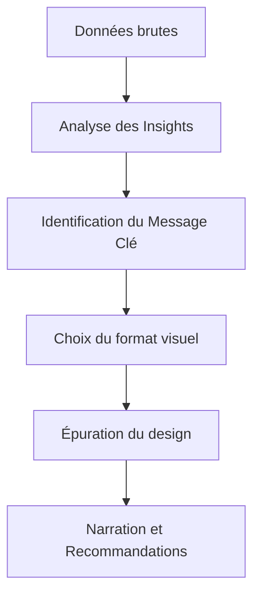

# 5-2-2 Principes de design et storytelling des données

Le storytelling des données est l'art de combiner une analyse rigoureuse avec une narration visuelle pour convaincre une audience. Il ne s'agit pas simplement de présenter des chiffres, mais d'expliquer leur signification et les actions qu'ils induisent.

## Concepts fondamentaux

*   **Le Message Clé** : L'idée unique que l'audience doit retenir.
*   **La Narration (Narrative)** : La structure logique qui relie les données (Contexte -> Problème -> Analyse -> Solution).
*   **La Charge Cognitive** : L'effort mental requis pour comprendre une visualisation. Un bon design réduit cette charge.

## Fonctionnement détaillé : La méthode narrative

Pour construire un récit autour des données, suivez cette structure :

1.  **Le Contexte (Le "Pourquoi")** : Définissez le périmètre, l'audience et l'objectif.
2.  **Le Problème (Le "Quoi")** : Identifiez l'écart entre la situation actuelle et la cible.
3.  **L'Analyse (Le "Comment")** : Présentez les preuves visuelles (graphiques) qui soutiennent votre constat.
4.  **L'Appel à l'action (Le "Maintenant quoi ?")** : Proposez des recommandations concrètes basées sur les données.

### Comparatif : Rapport vs Storytelling

| Caractéristique | Rapport classique | Storytelling des données |
| :--- | :--- | :--- |
| **Objectif** | Informer | Convaincre / Décider |
| **Structure** | Linéaire, exhaustive | Narrative, sélective |
| **Focus** | Données brutes | Insights et actions |
| **Engagement** | Faible | Élevé |

## Bonnes pratiques de design

*   **Éliminer le "bruit"** : Supprimez tout élément qui n'apporte pas d'information (bordures inutiles, fonds gris, quadrillages trop marqués).
*   **Utiliser la pré-attention** : Utilisez la couleur, la taille ou la position pour diriger le regard de l'audience vers l'élément le plus important.
*   **Texte et annotations** : Ne laissez pas le graphique parler seul. Ajoutez des annotations directes pour expliquer les pics ou les chutes brutales.

## Diagramme de flux du Storytelling

## Erreurs fréquentes à éviter

*   **Le "Data Dump"** : Présenter toutes les données disponibles sans sélection. Cela noie le message.
*   **L'incohérence visuelle** : Changer les couleurs ou les échelles entre deux diapositives, ce qui désoriente l'audience.
*   **Négliger l'audience** : Utiliser un jargon technique ou des graphiques trop complexes pour une audience de décideurs non experts.

## Points de vigilance

*   **Honnêteté intellectuelle** : Ne manipulez jamais les échelles pour faire paraître une variation insignifiante comme majeure.
*   **Accessibilité** : Assurez-vous que le contraste des couleurs est suffisant pour une lecture sur écran ou projecteur.
*   **Simplicité** : Si une explication nécessite plus de deux phrases, le graphique est probablement trop complexe.

## Recommandations actuelles

*   **Approche "Mobile-first"** : Concevez vos tableaux de bord pour qu'ils soient lisibles sur des écrans de petite taille.
*   **Interactivité guidée** : Si vous utilisez des outils interactifs, guidez l'utilisateur avec des infobulles ou des titres dynamiques pour éviter qu'il ne se perde dans les filtres.

## Sources

*   *Cole Nussbaumer Knaflic, "Storytelling with Data: A Data Visualization Guide for Business Professionals".*
*   *Edward Tufte, "The Visual Display of Quantitative Information".*