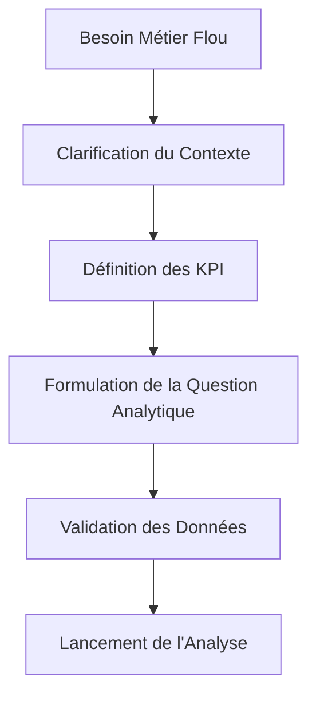

# 6-1-1 Définition du problème et structuration de la question analytique

L'analyse de données ne commence pas par l'outil, mais par la formulation d'une question précise. Une question mal définie conduit inévitablement à une analyse hors sujet, coûteuse en temps et sans valeur ajoutée pour l'entreprise.

## Concepts fondamentaux

*   **Problème métier** : Le besoin opérationnel ou stratégique (ex: "Le taux de désabonnement augmente").
*   **Question analytique** : La traduction du problème métier en une interrogation mesurable par les données (ex: "Quels sont les trois facteurs corrélés au départ des clients sur les 6 derniers mois ?").
*   **Hypothèse** : Une réponse provisoire à la question, que l'analyse devra confirmer ou infirmer.

## Fonctionnement détaillé : La méthode de structuration

Pour passer d'un besoin flou à une question analytique, utilisez la méthode de décomposition :

1.  **Clarification** : Échangez avec les parties prenantes pour comprendre le contexte réel.
2.  **Délimitation** : Définissez le périmètre (temporel, géographique, périmètre de données).
3.  **Opérationnalisation** : Identifiez les métriques (KPI) nécessaires pour répondre à la question.
4.  **Validation** : Vérifiez la disponibilité et la qualité des données requises.

### Exemple de transformation
*   **Besoin flou** : "Je veux améliorer les ventes."
*   **Question analytique structurée** : "Quel est l'impact de la campagne marketing X sur le taux de conversion des clients récurrents dans la région Y au T3 ?"

## Diagramme de structuration

## Comparatif : Questions vagues vs Questions analytiques

| Type | Exemple | Risque |
| :--- | :--- | :--- |
| **Vague** | "Pourquoi nos serveurs sont lents ?" | Analyse sans fin, aucune action claire. |
| **Analytique** | "Quelle est la corrélation entre la charge CPU > 80% et le temps de réponse de l'API X ?" | Identification d'un goulot d'étranglement précis. |

## Bonnes pratiques professionnelles

*   **Utiliser la méthode SMART** : Votre question doit être Spécifique, Mesurable, Atteignable, Réaliste et Temporelle.
*   **Identifier les variables** : Listez explicitement les variables indépendantes (ce que vous testez) et dépendantes (ce que vous mesurez).
*   **Documenter les hypothèses** : Notez vos suppositions avant de commencer l'analyse pour éviter le biais de confirmation (chercher uniquement les preuves qui valident votre idée).

## Erreurs fréquentes à éviter

*   **Sauter l'étape de définition** : Se précipiter sur les données sans savoir ce que l'on cherche.
*   **Ignorer les limites des données** : Poser une question pour laquelle aucune donnée fiable n'existe.
*   **Complexité excessive** : Vouloir répondre à trop de questions en une seule fois.

## Points de vigilance

*   **Biais de sélection** : Assurez-vous que les données utilisées pour répondre à la question sont représentatives de la réalité.
*   **Corrélation vs Causalité** : Une corrélation statistique ne signifie pas nécessairement un lien de cause à effet. Soyez prudent dans vos conclusions.

## Sources

*   *Barbara Minto, "The Minto Pyramid Principle" (pour la structuration de la pensée).*
*   *Guide méthodologique de l'analyse de données (références académiques en sciences de gestion).*