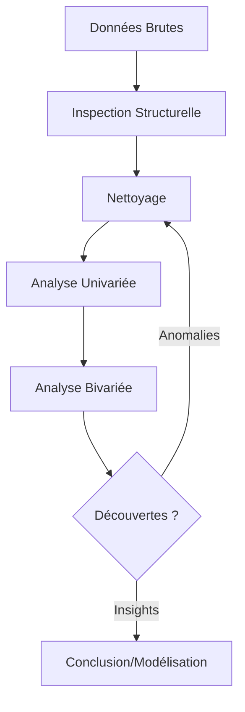

# 6-1-2 Collecte et EDA (Exploratory Data Analysis)

L'Analyse Exploratoire des Données (EDA) est l'étape où l'analyste "apprivoise" ses données. Elle précède toute modélisation ou reporting complexe et permet de vérifier la qualité, la structure et les tendances cachées du jeu de données.

## Concepts fondamentaux

*   **Collecte** : Extraction des données depuis les sources (SQL, API, fichiers plats, logs).
*   **EDA** : Approche consistant à résumer les caractéristiques principales des données, souvent via des méthodes visuelles et statistiques, pour découvrir des motifs ou des anomalies.
*   **Qualité des données** : Évaluation de la complétude, de l'exactitude et de la cohérence des données.

## Fonctionnement détaillé

L'EDA suit généralement un cycle itératif :

1.  **Inspection structurelle** : Vérification des types de données (numérique, texte, date), des noms de colonnes et des dimensions.
2.  **Nettoyage initial** : Gestion des valeurs manquantes (`NULL`), des doublons et des formats incohérents.
3.  **Analyse univariée** : Étude de chaque variable isolément (moyenne, médiane, écart-type, distribution).
4.  **Analyse bivariée** : Étude des relations entre deux variables (corrélation, nuages de points).

### Outils d'EDA
*   **Statistiques descriptives** : `COUNT`, `MIN`, `MAX`, `AVG`, `MEDIAN`.
*   **Visualisation** : Histogrammes (distribution), Boîtes à moustaches (détection d'outliers), Nuages de points (corrélation).

## Diagramme de flux de l'EDA

## Bonnes pratiques professionnelles

*   **Ne jamais modifier la source** : Travaillez toujours sur une copie ou une vue de vos données.
*   **Documenter les transformations** : Gardez une trace de chaque étape de nettoyage (ex: "suppression des lignes avec CPU > 100% car considérées comme erreurs de capteur").
*   **Traquer les valeurs aberrantes (Outliers)** : Une valeur extrême peut être une erreur de saisie ou, au contraire, l'information la plus importante de votre analyse (ex: une attaque par déni de service).

## Erreurs fréquentes à éviter

*   **Ignorer les valeurs manquantes** : Les supprimer sans comprendre pourquoi elles manquent peut introduire un biais majeur.
*   **Se fier uniquement aux moyennes** : La moyenne peut être trompeuse si la distribution est très asymétrique. Regardez toujours la médiane et l'écart-type.
*   **Oublier le contexte métier** : Une valeur peut paraître aberrante statistiquement mais être normale dans un contexte spécifique (ex: pic de trafic lors d'une opération commerciale).

## Points de vigilance

*   **Sécurité des données** : Lors de la collecte, assurez-vous de ne pas extraire de données sensibles (RGPD, mots de passe, clés API) si elles ne sont pas nécessaires à l'analyse.
*   **Volume des données** : Pour les très gros jeux de données, travaillez sur un échantillon représentatif lors de la phase d'exploration pour gagner en réactivité.

## Comparatif : Analyse Univariée vs Bivariée

| Type | Objectif | Outil privilégié |
| :--- | :--- | :--- |
| **Univariée** | Comprendre la distribution d'une variable | Histogramme, Boîte à moustaches |
| **Bivariée** | Identifier des relations ou dépendances | Nuage de points, Matrice de corrélation |

## Sources

*   *John Tukey, "Exploratory Data Analysis" (ouvrage de référence).*
*   *Documentation technique : Bonnes pratiques de nettoyage de données (Pandas/SQL).*