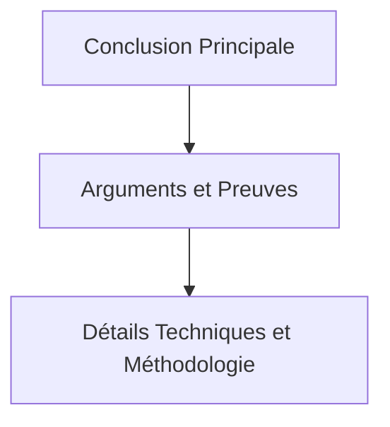

# 6-2-2 Storytelling et présentation des conclusions

La présentation finale est l'étape où l'analyse technique se transforme en valeur métier. Une présentation réussie ne détaille pas le processus de travail, mais se concentre sur les résultats et les décisions à prendre.

## Concepts fondamentaux

*   **Pyramide inversée** : Structure de communication commençant par la conclusion principale, suivie des arguments de soutien, puis des détails techniques.
*   **Audience cible** : Adaptation du niveau de technicité selon les interlocuteurs (décideurs, développeurs, clients).
*   **Appel à l'action (Call to Action)** : La recommandation claire et mesurable que l'audience doit valider.

## Fonctionnement détaillé : La structure de présentation

Une présentation de projet analytique suit généralement cet ordre :

1.  **Le constat (Le "Quoi")** : Présentation immédiate de la conclusion principale.
2.  **La preuve (Le "Pourquoi")** : Visualisations clés et chiffres-clés validant le constat.
3.  **L'impact (Le "Et alors ?")** : Conséquences métier (financières, opérationnelles, sécurité).
4.  **La recommandation (Le "Maintenant quoi ?")** : Plan d'action concret.

### Comparatif : Approche académique vs Approche métier

| Caractéristique | Approche académique | Approche métier (Storytelling) |
| :--- | :--- | :--- |
| **Ordre** | Méthode -> Résultats -> Conclusion | Conclusion -> Preuves -> Méthode (si nécessaire) |
| **Focus** | Exhaustivité | Pertinence |
| **Support** | Texte dense | Visuels épurés |

## Diagramme de la structure "Pyramide Inversée"

## Bonnes pratiques professionnelles

*   **Règle du "10/20/30"** : Pour une présentation orale, limitez-vous à 10 diapositives, 20 minutes, et une taille de police minimale de 30 points.
*   **Anticiper les questions** : Préparez une annexe technique avec les détails de votre EDA, vos modèles et vos sources de données pour répondre aux questions pointues.
*   **Utiliser des verbes d'action** : Dans vos recommandations, utilisez des verbes forts ("Réduire", "Automatiser", "Déployer") plutôt que des formulations passives.

## Erreurs fréquentes à éviter

*   **Chronologie linéaire** : Raconter l'histoire de votre travail ("D'abord j'ai fait ceci, puis cela...") ennuie l'audience qui attend des résultats.
*   **Surcharge de slides** : Mettre trop de texte sur une diapositive force l'audience à lire au lieu de vous écouter.
*   **Jargon technique non expliqué** : Utiliser des termes comme "Random Forest" ou "P-value" devant des décideurs sans en expliquer l'impact métier.

## Points de vigilance

*   **Gestion du temps** : Si vous avez 15 minutes, prévoyez 10 minutes de présentation et 5 minutes de questions-réponses.
*   **Cohérence visuelle** : Utilisez une charte graphique simple et constante (couleurs, polices) pour renforcer le professionnalisme.
*   **Vérification des faits** : Soyez prêt à justifier chaque chiffre présenté. Une erreur sur une donnée clé discrédite l'ensemble de votre travail.

## Recommandations actuelles

*   **Présentation hybride** : Préparez un support visuel (slides) et un document de synthèse (format PDF ou page web) que les participants peuvent consulter après la réunion.
*   **Interactivité** : Si possible, utilisez des outils de visualisation en direct (tableaux de bord interactifs) pour permettre aux décideurs d'explorer les données en temps réel.

## Sources

*   *Barbara Minto, "The Minto Pyramid Principle".*
*   *Guy Kawasaki, "The Art of the Start" (pour la règle du 10/20/30).*